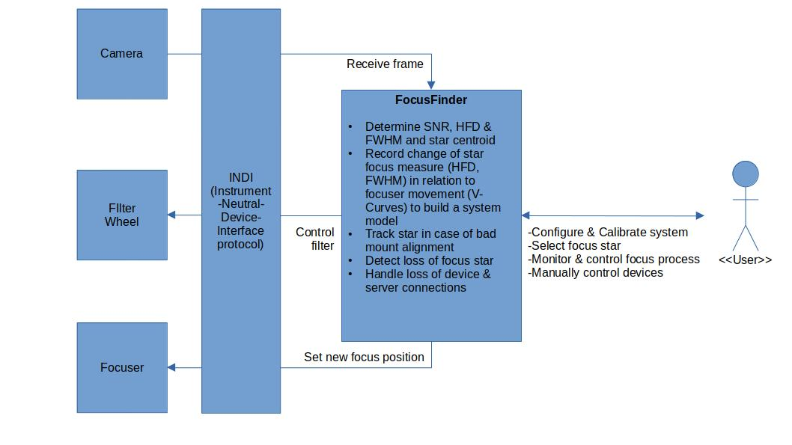

FoFi - The Telescope Focus Finder
===========

## Summary
This project is about an automatic focus finder software for telescopes. It targets the Linux platform in the first run and therefore currently only supports the [INDI standard](http://www.clearskyinstitute.com/INDI/INDI.pdf) (also see https://github.com/indilib/indi). Please note that this project is still in the proof-of-concept phase.

## Current project state
Without understatement this project currently is still in the proof-of-concept phase. That means it is not yet usable. However, if you think this project holds some potential and may be useful for you, or if you maybe work on a similar project, I would be happy to hear your feedback. We might join our efforts and share our experiences and of course any support in the development of this tool is also very welcome!

## Project vision
The software aims to support the amateur astronomer (and especially astrophotographer) with one of the most critical but also most annoying tasks: Finding the best focus position. The main goal is to provide a free and easy to use software that just does the job - automatically.

With a given configuration it should also be possible to execute "FoFi" from the command-line without requiring any user interaction. This way you can include a call to the Focus Finder into a script. This might be useful if the entire observation process should be automatized and you want to re-focus from time to time to compensate the temperature drift. 

## Project history
When starting this project there was the following situation: There was a free piece of software for automatically finding the "best" focus of the telescope: FocusMax. Steve Brady and Larry Weber developed it and offered it to the public in 2001. Meanwhile there is version 4 of this software available but as far as I was able to see it is no longer free. Instead CCDWare now offers it.

## System overview

TODO: Add textual description.

## Further information
Please visit my blog https://www.lost-infinity.com for further details. The first article I published about this project can be found here: https://www.lost-infinity.com/fofi-a-free-automatic-telescope-focus-finder-software

## build

### Install required dependencies
The following libraries are required to build FoFi on Ubuntu 20.04 LTS.
For other Linux distributions the package names may slightly vary.

	sudo apt-get update
	sudo apt-get install zlib1g-dev cimg-dev libindi-dev libnova-dev \
	                     libgsl-dev libccfits-dev qtbase5-dev libboost-dev \
	                     libboost-log-dev libboost-system-dev libboost-regex-dev \
	                     libboost-thread-dev libboost-program-options-dev \
	                     libboost-test-dev clang-tidy

### Checkout repository

	git clone https://github.com/carsten0x51h/focus_finder.git

### Configure the build
To build from command line, simply do the following steps:

	cd focus_finder
	mkdir build
	cd build
	cmake ..

This will generate the build environment for your operating system. It will fail
if at least one dependency to an external library could not be resolved.

The rest of this section is optional. To get finer grained control over the cmake process
the following options are available (the first one is always the _default_): 

	cmake .. -DOPTION_BUILD_DOC=OFF|ON
		 -DCMAKE_BUILD_TYPE=RELEASE|DEBUG|COVERAGE|PERF
		 -DCMAKE_VERBOSE_MAKEFILE:BOOL=OFF|ON
		 -DOPTION_ENABLE_CLANG_TIDY=ON|OFF
		 -DCMAKE_CXX_CLANG_TIDY="clang-tidy;-checks=-*,readability-*"
		 -DCMAKE_C_COMPILER=clang|gcc
		 -DCMAKE_CXX_COMPILER=clang++|g++

### Build the code
Run the following command to build the project: 

	cmake --build . -- all

or to build parallel on e.g. 12 cores, run

	cmake --build . -j12 -- all

### Run the program
To run the focus finder GUI simply execute

    ./focus_finder_gui

The UI asks for hostname and port of the INDI server (typically localhost:7624).

An INDI server with simulated devices for testing can be run using the following command:

    indiserver -v /usr/bin/indi_simulator_ccd \
                  /usr/bin/indi_simulator_wheel \
                  /usr/bin/indi_simulator_focus \
                  /usr/bin/indi_simulator_telescope

The _-v_ enables debug level 1 so that a few details are printed to the console. 
